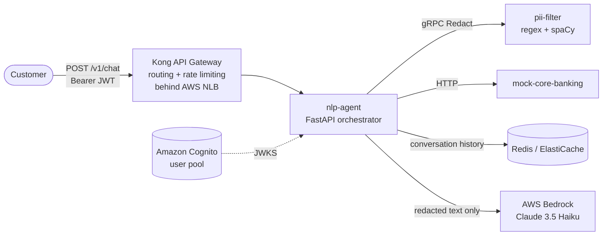

# OmniBank AI — Conversational Agent

A Kubernetes-deployed conversational agent that answers OmniBank customers' banking
questions in Spanish — balances, transactions, product info and FAQs — on behalf of
authenticated users. University project, DevOps & SRE, UNAL 2026.

**Thesis:** every team can wire an LLM to a banking API; few can prove the data path
is safe. OmniBank AI's defining constraint is that **customer PII never reaches the
third-party LLM**. Every user message *and* every backend banking response is passed
through a dedicated PII-redaction service before any text is sent to AWS Bedrock, and the
agent **fails safe** — it refuses to call the LLM at all if the filter is unavailable.

- **PRD:** issue [#1](https://github.com/NorelyJ/omnibank-ai-grupo2-UN/issues/1)
- **Slice plan:** issues [#2 – #13](https://github.com/NorelyJ/omnibank-ai-grupo2-UN/issues)

## Architecture



**Request flow:** client → Kong (DBless, behind an AWS NLB) → nlp-agent. The agent
validates the Cognito ID token, scrubs the user message through pii-filter (gRPC),
looks up real data from mock-core-banking (HTTP) via Bedrock (Claude) tool use, scrubs
each tool result, persists redacted history in Redis, and returns a Spanish reply.
**Only redacted text ever reaches AWS Bedrock (Claude Haiku).**

Ten deep modules: PII detector, redaction policy engine, conversation orchestrator,
tool dispatcher, LLM client adapter, Redis history client, PII-filter gRPC client,
customer repository, JWT validator, metrics emitter.

## Repo layout

```
services/
  nlp-agent/          FastAPI agent — Bedrock (Claude) tool use, in-agent JWT, /v1/chat
  pii-filter/         gRPC PII redactor (regex + spaCy) + FastAPI sidecar
  mock-core-banking/  FastAPI mock bank data from baked-in JSON
infra/
  terraform/          AWS infrastructure (VPC, EKS, Cognito, ElastiCache, Secrets)
  helm/               per-service + umbrella Helm charts, kps/kong/fluentbit values
  kong/               Kong DBless declarative config
  argocd/             ArgoCD Application manifest
  kind/               kind cluster config
  observability/      Grafana dashboard ConfigMap
docs/                 architecture, demo Q&A, demo artifacts
.github/workflows/    CI pipeline
docker-compose.yml    local dev stack       Makefile  all common operations
```

## Run locally (docker-compose)

> **AWS credentials required.** The agent now calls Claude Haiku on **AWS Bedrock**
> (keyless — no API key). Local dev therefore needs AWS credentials with Bedrock
> model access. Export them before `make dev`:
>
> ```bash
> aws sso login                                   # or: aws configure
> eval "$(aws configure export-credentials --format env)"
> make dev
> ```
>
> In EKS the same code authenticates via IRSA (the pod's ServiceAccount assumes an
> IAM role) — there is no secret to manage. This is the trade-off of the
> "Bedrock everywhere" decision: one code path, but local dev is no longer AWS-free.

```bash
cp .env.example .env          # no API key needed — auth is via AWS credentials
make dev                      # docker compose up --build — Redis + all 3 services
```

The local stack runs with `SKIP_JWT_VALIDATION=true` and acts as customer
`CUST-001` (Juan) via `DEV_USER_BANK_CUSTOMER_ID`. The agent **refuses to start**
(`exit 2`) if `SKIP_JWT_VALIDATION=true` while `ENV=production`.

```bash
make test     # pytest in every service          make lint    # ruff check + format
make help     # all targets
```

## The four intents

With the local stack running (`http://localhost:8000`):

```bash
# 1 — Balance
curl -X POST localhost:8000/v1/chat -H 'Content-Type: application/json' \
  -d '{"message": "¿cuál es mi saldo?"}'

# 2 — Transactions
curl -X POST localhost:8000/v1/chat -H 'Content-Type: application/json' \
  -d '{"message": "muéstrame mis últimos movimientos"}'

# 3 — Products
curl -X POST localhost:8000/v1/chat -H 'Content-Type: application/json' \
  -d '{"message": "¿qué tarjeta de crédito ofrecen?"}'

# 4 — FAQ (answered from prompt knowledge, no tool call)
curl -X POST localhost:8000/v1/chat -H 'Content-Type: application/json' \
  -d '{"message": "¿cuál es el horario de atención?"}'
```

PII demo — a cédula is redacted before it reaches the LLM; a card number is blocked
outright:

```bash
curl -X POST localhost:8000/v1/chat -H 'Content-Type: application/json' \
  -d '{"message": "mi cédula es 1020304050"}'          # → redacted, warning shown
curl -X POST localhost:8000/v1/chat -H 'Content-Type: application/json' \
  -d '{"message": "mi tarjeta es 4532015112830366"}'   # → blocked, no LLM call
```

## Run on EKS

```bash
cd infra/terraform && terraform init && terraform apply   # VPC, EKS, Cognito, ElastiCache
cd ../.. && make deploy-eks      # IRSA role attached to pod — no secret needed → Helm deploy
make install-kong                # Kong API gateway (NLB)
make install-kps                 # kube-prometheus-stack + Grafana dashboard
make install-logging             # FluentBit → CloudWatch (see LabRole note)
```

### Multi-user demo flow

Three Cognito users are pre-provisioned by Terraform — Juan (`CUST-001`),
María (`CUST-002`), Carlos (`CUST-003`):

```bash
NLB=$(kubectl get svc kong-kong-proxy -o jsonpath='{.status.loadBalancer.ingress[0].hostname}')

TOKEN=$(make get-token USER=juan)
curl -X POST https://$NLB/v1/chat -H "Authorization: Bearer $TOKEN" \
  -d '{"message": "¿cuál es mi saldo?"}'      # → Juan's balance

TOKEN=$(make get-token USER=maria)
curl -X POST https://$NLB/v1/chat -H "Authorization: Bearer $TOKEN" \
  -d '{"message": "¿cuál es mi saldo?"}'      # → María's (different) balance
```

Asking without a token, or with a token signed by another key, returns `401`.

## Continuous integration

`.github/workflows/ci.yml` runs on every pull request and on pushes to `main`:
**lint** (`ruff`), **test** (`pytest` per service), **build-and-push** (multi-stage
Docker images to `ghcr.io/<owner>/omnibank-<service>`, git-SHA tagged, `:latest` on
`main`; PRs build but do not push).

## Observability

Every service exposes Prometheus metrics on `/metrics` — default HTTP metrics plus
custom counters (`omnibank_pii_redactions_total`, `omnibank_llm_cost_usd_total`,
`omnibank_tool_calls_total`, …). **No metric label ever carries a customer ID.**
`make install-kps` installs kube-prometheus-stack and the curated six-panel
"OmniBank Chat Overview" Grafana dashboard (`infra/observability/`). Container logs
ship to CloudWatch via a FluentBit DaemonSet (`make install-logging`).

## Cost discipline

The project runs under an AWS Academy **$100 credit cap**. Makefile targets enforce
a stop/destroy cadence:

| Target | When | Effect |
|---|---|---|
| `make stop-night` | Weeknights (~8pm) | EKS nodes → 0, ElastiCache destroyed |
| `make start-day`  | Next morning | Nodes → 2, ElastiCache recreated |
| `make destroy-all`| Weekends | Full `terraform destroy` (typed confirmation) |
| `make budget-check` | Daily | Month-to-date spend vs the $100 cap |

Set an 8pm weeknight team reminder. Expected envelope: ~$110–125 of raw resource
time compressed by the cadence to **under $90**.

## API gateway and authentication

Kong (DBless, behind an NLB) owns **routing + rate limiting** (`30 req/min` per IP
on `/v1/chat`). **JWT validation is done in the agent** — wiring OSS Kong's `jwt`
plugin to Cognito needs Cognito's *rotating* RSA keys templated into a static
DBless file, and OSS `request-transformer` cannot forward JWT claims as headers.
`app/auth.py` (`python-jose`) fetches and caches Cognito's JWKS, verifies
signature/expiry/audience, and reads the custom claims directly — handling key
rotation automatically. It is unit-tested offline (`tests/test_auth.py`). The agent
also accepts a Kong-injected `X-Bank-Customer-Id` header, so a future gateway-side
validation can be slotted in without code changes.

## Locked architectural compromises

Every compromise below is forced by AWS Academy constraints ($100 cap, rotating
4-hour credentials, `LabRole`-only IAM, `us-east-1`):

1. **AWS Bedrock (Claude 3.5 Haiku).** The agent calls Bedrock via IRSA — no API key
   is stored. AWS Academy does not support Bedrock in lab accounts, so the demo runs
   against a personal AWS account for Bedrock access.
2. **ECR → GitHub Container Registry.** `LabRole` cannot create the IAM OIDC
   provider GitHub Actions needs to push to ECR; ECR stays declared in Terraform
   for reference. CI publishes to `ghcr.io` with the built-in `GITHUB_TOKEN`.
3. **Cognito ID token, not access token.** `LabRole` cannot provision the
   Pre-Token Generation Lambda needed to put `custom:bank_customer_id` on the
   access token, so the agent reads it from the **ID token**.
4. **IRSA for Bedrock (keyless).** The nlp-agent pod's ServiceAccount is annotated
   with an IAM role that grants `bedrock:InvokeModel`. No API key or Kubernetes Secret
   is needed — the AWS SDK picks up credentials from the pod's IRSA token automatically.
5. **No TLS / no AUTH on ElastiCache Redis.** The TLS-capable replication group is
   harder to provision under `LabRole`; the plain cache cluster is used. Redis only
   ever holds PII-redacted text, and is reachable only inside the VPC.
6. **NetworkPolicies declared, enforcement depends on the CNI.** The zero-trust
   policies are always declared in Helm; enforcement requires a policy-capable CNI
   (Calico is installed in kind — `make kind-up`).
7. **ArgoCD on the demo cluster only.** The ~20-minute install is not justified on
   clusters destroyed nightly, so ArgoCD reconciles the week-3 demo cluster only;
   daily deploys use `make deploy-eks`.

One further deliberate decision: the authenticated user's **own first name** is the
single piece of personal data deliberately passed to AWS Bedrock, for a personalized
greeting — it is documented and controlled, every other identifier is redacted.

## Production gaps

What would change before this went to real production:

- A real core-banking integration (not JSON baked into an image).
- TLS + AUTH on Redis; External Secrets for any remaining secret management (IRSA is already used for Bedrock).
- Distributed tracing (Jaeger/Tempo) and a service mesh with mTLS.
- A post-LLM PII scan (currently only pre-LLM input and tool results are scanned).
- AlertManager + on-call paging; streaming (SSE) chat responses.
- Automated CD to EKS (blocked here by rotating AWS Academy credentials).
- Multi-region / multi-AZ resilience; HPA validated under a real load test.
- A managed WAF and per-route auth at the gateway.

## Demo

See `docs/demo/` for demo-day artifacts and `docs/qa.md` for the rehearsed answers
to adversarial questions ("what if Redis dies mid-chat?", "where is my cédula
actually stored?", …).
