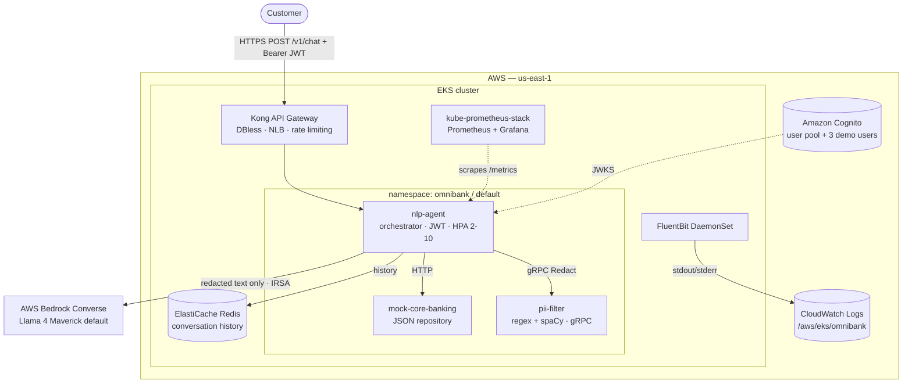

# OmniBank AI — Architecture

## System diagram

## Request lifecycle of one chat turn

1. **Gateway.** Kong terminates the request, applies rate limiting (30/min per IP),
   and forwards to nlp-agent.
2. **Auth.** The agent validates the Cognito **ID token** against the cached JWKS
   and extracts `custom:bank_customer_id` + `given_name` (`app/auth.py`).
3. **Scrub input.** The user message goes to pii-filter over gRPC. Cédula, NIT,
   phone, email, account, IP and spaCy-detected names/locations/orgs are replaced
   with `[TIPO]` placeholders; a card number **blocks** the whole request. If the
   filter is unreachable, the agent fails safe — no LLM call.
4. **Reason + tools.** The redacted message goes to AWS Bedrock via the Converse API
   (default Llama 4 Maverick, `us.meta.llama4-maverick-17b-instruct-v1:0`; model-swappable
   via `BEDROCK_MODEL_ID`) with three typed banking tools. The tool-call loop is bounded
   to 3 iterations.
5. **Scrub tool results.** Every mock-core-banking response is scrubbed by
   pii-filter (`source="tool_result"`) before re-entering the LLM context.
6. **Persist.** The redacted user message and the reply are appended to Redis
   (`conversation:{customer_id}`, 24h TTL, max 20 messages, best-effort).
7. **Respond.** The Spanish reply is returned. Custom Prometheus metrics
   (redactions, tool calls, LLM cost/tokens) are emitted throughout.

## The PII boundary

The thesis in one line: **the only text that crosses the boundary to AWS Bedrock is text
that has been through pii-filter.** There is no code path from a raw user message
or a raw banking response to the Bedrock client that does not pass through
`pii_redact()` first — and if redaction cannot be performed, the turn is refused.
